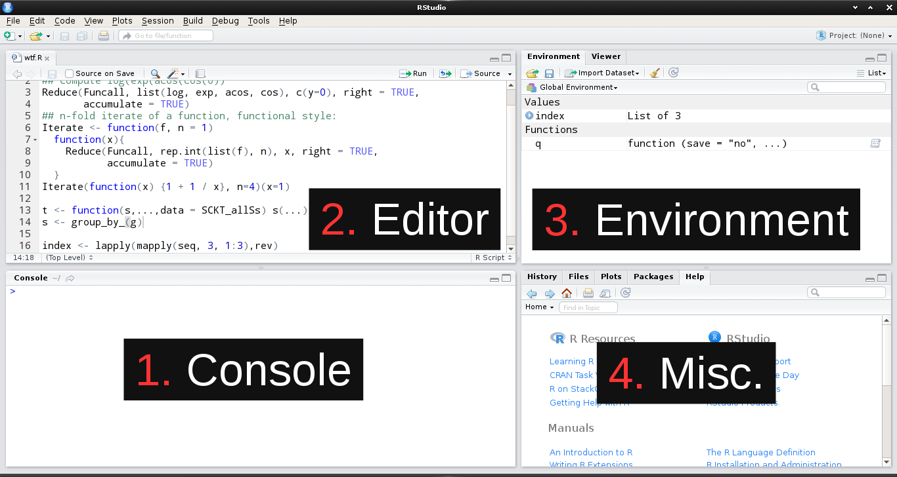

```{r setup, include=FALSE}
knitr::opts_chunk$set(prompt=TRUE, cache = TRUE) 
```


## The R Language 

- R is a programming language and computing environment specialized for statistical analysis, data manipulation and reporting.
- We can use it to perform statistical tests, create data visualizations, connect to databases, write files to disk, etc...
- Despite its focus being data and statistics, it is still very feature rich, and relatively easy to learn, as far as programming languages go. 
- Download at https://cran.r-project.org/

## Rstudio 

- Rstudio is a graphical front end that simplifies common tasks, prettifies things, and makes it easier to use R. 
- Rstudio is like a workbench and toolbox, where R is like a hammer. 
    - It certainly is possible for you to use your hammer to build something *without* a workbench and toolbox
    - But it's nice to have the workbench to rest things on while you work, and to have the toolbox holding your nails right next to your hammer, etc. 
- Download at https://www.rstudio.com/products/rstudio/download#download

## The Rstudio IDE*


*Integrated Development Environment

## 1: The Console

- The console pane allows interactive use of the R interpreter
    - This is the program on your computer that listens to incoming R commands (called *expressions*), evaluates them, and gives you back a result or an error.
- Input is given at the prompt (the `>` symbol) and output is printed below the command you enter
- Examples with basic math (`*` = multiplication, `/` = division)

```{r basicMath,echo=TRUE}
2+2
# R knows the order of operations
2*10 + 3/10
```

## Console Tricks

- Tab completion of variables and functions
- Navigate the history of commands you've entered with the up and down arrow keys

## Activity: **Try out the console**

Try out several basic mathematical operations

- `+` = addition
- `-` = subtraction
- `/` = division
- `*` = multiplication
- `^` = power of

Practice using the up-arrow key to navigate your history

## 2: The Editor

- The editor pane is where you can create, modify, and save plain text documents, and is designed to help you create R scripts
- An R script is just a text file that contains valid R code (the same kind of commands you would enter into the console)
- R scripts are more like stand-alone computer programs. 
    - Writing your commands down into an executable R script allows you to quickly and easily repeat a series of commands
    - So, if you are doing a task with multiple steps and want to save your work for later use, write an R script!

## Comments

- Another reason to write your code in an R script is to keep a short explanation of what you are doing (and why!) together with your code
- These short explanations are called *comments*
- In R, you write a comment by prefixing the comment's text with the pound sign `#`
  - Comments can go on their own line, or at the end of an R expression
  
```{r comments}
# Hi I am a comment. 
# The R interprer ignores me!
2*10 + 3/10 # comments can go here too!
```

## Editor Tricks

- When you have an R script open in the editor, you can run all the code it contains with the *source* command.
    + Ctrl + Shift + S shortcut on PC 
- You can run the code on the line your cursor is on using the *run* command
    + Ctrl + ENTER shortcut on PC 
- You can highlight blocks of code, and run all the lines in that block with *run*  or Ctrl + Enter

## Activity: **Try out the editor**

1. Create a new R script (Try out **Ctrl** + **Shift** + **N**)
2. Copy all the basic math operations you did in the console to your script
3. Save it (anywhere, just take note of where)
4. Open it again, and run it 3 different ways
    + Line by line
    + Highlight all lines and run 
    + Source the document

## 3: The Environment & Objects

The environment pane shows you a list of all the R objects available to you. 

- An R object is like a variable from algebra: they are named stand-ins for pieces of R code that you can utilize.
- An object (a.k.a. variable) is defined by a name and value pair, linked together by the *assignment operator*
    - The assignment operator is the symbol `<-`. 


## 3: Object Examples {.smaller}

Here let's create an R object called `v` with the value set to the expression `2*10+3/10` 
```{r assigment1}
v <- 2*10+3/10
v
```

Now we can use the variable `v` as a stand-in for the value `20.3`.
```{r assignment2}
dos <- v*3 # same as 20.3*3
dos 
```

We can change the value of the object **`v`**, but it doesn't affect the object **`dos`**.
```{r assignment3}
v <- .5
dos
```

## Object Examples

This demonstrates that R objects are only dependent at the time of assignment. After assignment, they are independent of one another. 

To help understand this, imagine the previous example of variables and values, but with people and and money instead.

We have 2 people, Lap and Andrea.

Andrea has 20 dollars, and Lap has the same amount of money as Andrea, plus 100 dollars more. 

Later, Andrea blows her last $20 on Busch light and lotto scratchers, but of course only Andrea loses $20. What happens to Andrea *only* affects Andrea, and Lap is still rich. 

## Activity

Replicate the Lap and Andrea example, but with two new variables. 

1. Assign a quantity to the first variable (you can name it whatever you want).
2. Assign another quantity to the second variable, using the first variable in the expression to create the second one.
3. Then, change the value of the first variable, and observe the results this change has on the value of both variables. 

## 4: Miscellaneous | Tabs to know

- History: List of commands you've given
    + Double click to re-evaluate
- Plots: Tab where graphics are displayed after they are made/"printed"
- Packages: List of installed and loaded packages
    + Groups of additional commands you can load into R
    + Checked = loaded
- Help: Documentation on R functions
    + `?mean`

## Excercises

1. Write an R script that assigns two variables (name them as you see fit) where each variable is a single number.
2. Then, create a third variable in the same script that is a result of a mathematical operation using the first two variables. 
3. Share this script with your neighbor (email, flash drive, however). Then have them try open it, source the script, and tell you what the value of the third variable is. 


Collaboration is OK!


## Advanced Extras 

## The Environment
- An environment is like a home for your objects to live in. 
- When you use a script or the console to create a new object, that object is assigned into the Global Environment. 
- There can be many environments (see the drop down menu in the Environment pane, or type `search()` in the console to see the current ones)
- The environments follow a hierarchy - the ones at the top can see the ones below them, but not vice versa.
