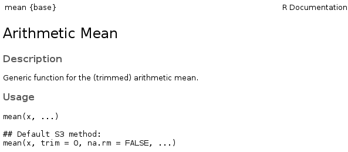
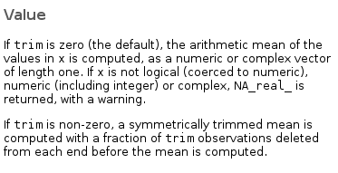
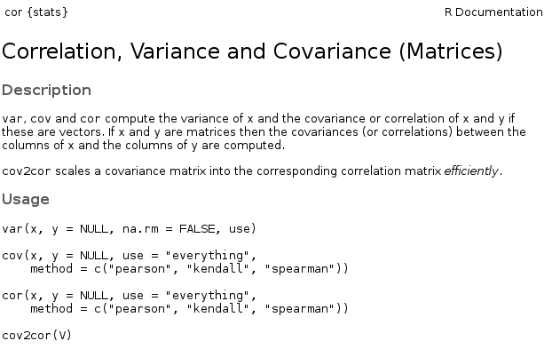
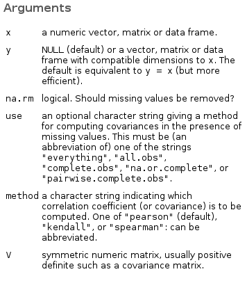
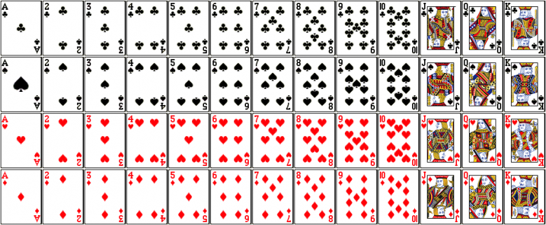

```{r setup, include=FALSE}
knitr::opts_chunk$set(prompt=TRUE, cache = TRUE) 
```

## Functions

So far, we have used several functions in lab examples and activities, and many more in the R scripts from lecture. 

Today we will be learning more about how to use functions in general through the lens of the help pages for 2 functions: `mean()` and `var()`. 

But what are functions, other than the names of things you type in to get your answers?

## What is a Function?

A function is fixed piece of code that accepts input values, performs some operations or calculations on these values, and returns some results. 

A good way to start thinking about functions is think about algebraic equations. For instance, if we have the algebraic equation $y=\sqrt{x}$:

- $x$ is the input
- $\sqrt\\$ is the operation performed on the input
- $y$ is the output, in this case the result of taking the square root of $x$

## Function  Terminology:

- When you use a function in your script, you are performing a 'function call' (in computer science-ish terms). 
- This leads to colloquialisms like "Call mean on that matrix" or "This code calls diag to extract the diagonal elements".
    - 'Call' does not mean anything special to us. All using the word 'call' means in this context is 'use a function'. 
- The inputs to functions go by several names, but most often they are called "**arguments**" or "**parameters**".
    - Calling a function with some specific input is often called "passing an argument".
    - Don't confuse function parameters with population parameters from the statistics side of class
    
## ?mean {.img-centered .helppage}
Lets start by going to the help page for the mean. You can access it two easy ways:

1. Type `?mean` into the console
2. Go to the 'Help' tab in the miscellaneous pane of Rstudio and in the search box type 'mean'. 


<br>

## ?mean {.image-column .helppage}


In the top left corner, you are shown the name of the help page you are on, as well as the package/namespace the function lives in.

Under that is the title of the help page, and a basic description of what the functions listed on this page are used to accomplish

## ?mean: usage {.image-column .helppage}


The usage section tells you:

  - The syntax for invoking the function
  - The names of the accepted arguments
  - The order of the arguments
  -  Which arguments are required and which are optional
      + Arguments with an `=` are optional
      + All others are required

## ?mean: Usage {.image-column .helppage}


But the usage section is also cryptic!
 
  - What is x?
  - What is trim?
  - What do they do?

For clarification, we must go the the arguments sections.

## ?mean: Arguments {.image-column .helppage}


The detailed descriptions in the arguments section tell us what types of values each argument is permitted to take on.

It also tells us what aspect of the function's behavior each argument controls.

For example, the `na.rm` argument must be a logical value (i.e., `TRUE` or `FALSE`) and it controls whether or not missing values are removed before finding the mean.


## Named vs. Unnamed Arguments
Every function argument has a name (e.g., `x`, `na.rm`, `trim`). When you call a function, those names can be used in a `keyname = value` style of syntax, or they may be omitted in favor of just specifying the value. 

If you wish to omit the names of the arguments when calling a function **you must order your inputs in the exact same order as they appear in the `Usage` section!!!**

If you specify arguments as `keyname=value` pairs, they may be passed in any order. 

If you mix and match named and unnamed, unnamed inputs that R encounters will be paired up with the unmatched arguments following their order in the Usage section.

## Named vs. Unnamed Examples
```{r named_examples}
data <- c(4,10,3,33,2,NA,43,22,31,95)
mean(x=data) # named key/value style
mean(x=data,na.rm=TRUE) # removing na's changes output
mean(data) # unnamed style
```
<div class="errormsg">
```{r unnamed_examples,error=TRUE}
mean(data,TRUE) #TRUE gets matched up with trim, not na.rm!
```
<div>

## Named vs. Unnamed: Verdict? {.img-centered}
Prefer named arguments. 


## An Argument's Name vs. An Argument's Value

As we just discussed, all the arguments a function accepts have a name that identifies them. 

Inside the function, the argument names are used as the names of R objects that the code acts upon.

So, when you call `mean(x=data)` (or `mean(data)`), the values you had stored in `data` become known to the code inside the `mean` function by the name `x` instead of `data`.

## Scoping
-  The code which calculates the mean runs "in its own world"
    - These worlds have their own names: **environments**
    - You don't see objects in the function's environment, and it doesn't see "your" environment (which is known as the "calling environment").
        - When you call a function from the command line, or in a script, the calling environment is the global environment.
- The only way for objects in **your** environment to get into the function environment, where the cool calculations take place, is through the function interface.*
<br>
<br>
<br>
<br>
<br>
<br>
<span style="font-style: italic; font-size: 14px;">
\*Unless the calling environment _is also_ the enclosing environment, but we are not going to worry about that now.
</span>

## Scoping
<br>

## Scoping
```{r scoping_demo}
data <- c(10, 11, 12)
x <- c(1, 2, 3)
mean(x=data) # Takes the mean of data, not of x from global env
x # didn't re-assign in global env
mean(x) #same as mean(x=x)
```

<div class="errormsg">
```{r scoping_error,error=TRUE}
mean()
```
<div>

## `...` : The "dot dot dot"
- You will often encounter the lines like "`...` __: further arguments passed to other methods__" in the `Arguments` section.
- A full explanation of the `...` is beyond the scope of our class, but for our purposes, we can treat it like a special catch-all device for inputs that aren't otherwise explicitly specified.
- Protip: When looking for help on this, do not google "R dot dot dot" of "R ...". It will not be helpful. Instead, google for "R ellipsis"

## ?mean: Value {.image-column .helppage}


The value section tells you about what the function returns to you when it finishes its calculations.

  - The type of data structure (e.g. list, matrix, etc.)
  - What values are held in that data structure

The return value may differ depending on which arguments were used, and what their values were.

## ?mean: Examples {.image-column .helppage}


Help pages generally end with a section showing toy examples of using the function.

These examples can demonstrate common use cases for the function.

They can also show the effects of using different combinations of arguments on the returned value.

## ?var {.img-centered .helppage}
Lets take a look at the help page for the `var()` function now.

The first thing you might notice is that the information about the `var()` function is on the help page for the `cor()` function!

<br>

## ?var {.image-column .helppage}

While there are 4 different functions defined here, they all have similar syntax

In fact, looking at the `Arugments` section we see that there are only 6 unique arguments between these 4 functions!

## Activity: Simulating Card Dealing {.img-centered}
Your activity is to simulate dealing a hand of 5 cards from a standard deck of playing cards. 

The cards have face values of 2 through 10, as well as the Ace, King, Queen, and Jack. Each of those cards comes in all 4 suites (Clubs, Diamonds, Hearts and Spades).

<br>

## Creating the deck {.img-centered}
1. Create a vector representing the face value of each card in the deck. Abbreviate Ace as "A", King as "K", etc. 
    - Hint: Check out `?rep`
    - Hint: The face value vector should have as many "Kings" as the real deck (4)
    - Hint: Have the order of the face values match the order in the image
    
<br>

## Creating the deck {.img-centered}
2. Create a vector representing the suite of each card in the deck. Abbreviate Hearts as "H", Clubs as "C", etc. 
    - Hint: The suites vector should have as many "Hearts" as the real deck (13)
    - Hint: Have the order of the suites values match the order in the image
    
<br>

## Creating the deck
3. Combine these 2 vectors into a single vector that representing the deck of cards
    - Hint: Check out `?paste`
    - Hint: Each element of the vector should be face-value/suite combination, like "AH" for ace of hearts.

    
## Dealing the Cards 
4. Simulate drawing 5 cards from this virtual "deck" vector.
    - Hint: Check out `?sample`
    - Hint: Be sure that you are sampling cards like a real dealer: without replacement!
  
```{r solution,prompt=FALSE,include=F}
cards <- rep(c(1:9,"A","K","Q","J"),4) # 1-9, Ace King Queen Jack
suites <- rep(c("C","H","D","S"),each=13) # Clubs,Hearts,Diamonds, Spades
deck <- paste0(cards,suites)
cards <- sample(x=deck,size = 5,replace = FALSE)
cards
```

