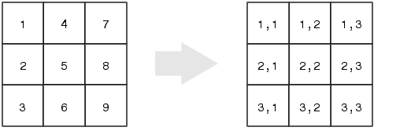

<style>
.columns-2 {
    -moz-column-rule: none;
    -webkit-column-rule: none;
    -ms-column-rule: none;
    column-rule: none;
}
</style>

```{r setup, include=FALSE}
knitr::opts_chunk$set(cache = TRUE) 
```

## Recall...
- Subsetting is the process of slicing a smaller chunk out of a larger data structure
- Basic syntax template is `DataStructure[IndexVector]`
- the `IndexVector` can be a numeric or logical vector
- Logical testing uses relational operators like `<` and `==` and logical operators (e.g., `&&` and `||`) to test which elements in our data structure meet specific requirements 

## Higher Dimensional Structures
Now we'll learn how to index data structures with more than one dimension. 

- Recall that Matrices and Data Frames have both rows **and** columns, making them a 2D data structure
- This means when we index them, we must specify which rows we would like to take out in our subset, as well as which columns

* Lists are *technically* 1D vectors, but they have tricky differences from atomic vectors, so we'll save them until the end.

## Indexing Matrices
To index a matrix, all that is required is to have two vectors inside our square brackets, separated from each other by a comma.

The template is: `OurBigMatrix[rowIndex, columnIndex]`

Like with vectors, the index vectors can be either:

- numeric vectors specifying the position of the rows/columns we want to access
- logical vectors specifying for each column and row whether we want to access it (`TRUE`)  or ignore it (`FALSE`)

## Matrix Examples
Create a small matrix & index it with numeric vectors:
```{r mat_examples}
dummy <- matrix(6:1, nrow = 2)
dummy
dummy[1,2:3] # Row 1, Column 2 and 3. Output is a vector! 
dummy[1:2,2:3] # Row 1 and 2, Column 2 and 3. Output is a matrix.
```

## Matrix Examples
If you want to select **all** of one dimension, (e.g., keep all rows or all columns) but  index the other dimension, provide the separating comma as usual, but don't give any indexing vector for the dimension you want to stay 100% intact.
```{r mat_examples3}
dummy[1,] # First Row, all columns
dummy[1,1:3] # Same as previous
dummy[,2] # All rows, second columns
dummy[1:2,2] # Same as previous
```

## Logicals & 2D structures
We can apply our relational operators to entire matrices in the same manner as vectors. The resulting logical matrix has the same dimensions as the one we apply the test to.
```{r vectorized_logical}
dummy < 4 # 2 x 3
dummy >=3 & dummy <= 5 # also 2 x 3
```

## Logicals & 2D structures
We can also apply logical testing and logical indexing to specific dimensions of a matrix. 

This example here keeps all the columns of the matrix with a sum less than 8.
```{r mat_examples4}
colSums(dummy) # colSums() adds up each column
colSums(dummy) < 8 # Does each column sum to less than 8?
dummy[,colSums(dummy) < 8] # Select columns with a sum less than 8
```

## Logicals & 2D structures
This example keeps all the rows of the matrix where the value in the first column is greater than 5.
```{r mat_examples5}
dummy[,1]
dummy[,1] > 5
dummy[dummy[,1] > 5,] # R drops dimensions by default!
dummy[dummy[,1] > 5, ,drop=FALSE] # drop=FALSE preserves dimensions!
```

## Activity

1. Create the following matrix $\left(\begin{array}{cccc} 1 & 4 & 7 \\ 2 & 5 & 8 \\ 3 & 6 & 9 \end{array}\right)$
2. Subset the value from the first row and second column
3. Subset the the first and the third column
5. Subset the columns that have a mean of more than 4 (Hint: apply the `colMeans` function to the matrix)

```{r activity1_solutions,include=F}
x <- matrix(1:9,nrow=3)
x[1,2]
x[,c(1,3)]
x[1:3,1:3]
x[,colMeans(x) >4]
```


## Data Frames 
To learn about data frames, we're going to use several data frames that come built-in with R as part of the `datasets` package. Try typing `InsectSprays`, `iris`, `airquality` and `mtcars` into the console to be sure they are loaded and available to you. 

Since they are included as part of a package, you will *not* see them listed in your environment pane. 

## Data Frames 

- The `[row,column]` indexing style used with matrices also applies to data frames
- Data Frames also support a powerful name-based set of indexing operations
- Indexing based on the name you've assigned to a row or column is almost always better, because that name is unlikely to change, while the row or column number is **very** likely to get changed
- It's also much easier to remember the name of something than remember its position in a data frame

## Data Frames
We have previously seen examples of subsetting a *single* column from a data frame using that columns name, and the `$` operator. 
```{r dollar}
mtcars$mpg
```

## Data Frames
To subset *multiple* columns, we need to use `[row,column]` style indexing (not the `$`). 

But we're not forced to use numeric vectors just because we're using the `[` operator. We can select multiple columns by their names using a character vector that has the names of our desired columns as its elements.

```{r multiple_cols,R.options=list(max.print=15)}
mtcars[,c("mpg","disp","gear")] # need  as well as the quotes here
```

## Data Frames
One of the most common subsetting tasks with a data frame (or matrix) is the need to select values in one column **where the values in another column meet a certain criteria**.

- You want to select all the values in the column holding reaction times where participants were incorrect
- You want to select values in the column holding the value of a companies net worth for companies founded in the last 5 years
- Infinitely more...

There are 2 syntactic approaches to this, both of which use relational operators & logical indexing.

## Method 1: Index the data frame itself
We will use the `[row,column]` method to pick out the values of the `count` column in `InsectSprays` where spray A was used. 

- First, we will build up a logical vector to index the correct rows by testing where the spray column has value 'A'
```{r method1_part1,R.options=list(max.print=30)}
InsectSprays$spray
InsectSprays$spray=="A"
```

## Method 1: Index the data frame itself

- Next, we combine this with a character vector of the column names we're interested in, and put it inside our `[]` brackets
```{r method1_part2}
InsectSprays[InsectSprays$spray=="A",'count']
```
- If we leave the column vector out, this statement will return a data frame. Can you guess how many unique values will be in the spray column in this case?

## Method 2: Index a vector *from* the data frame

- Now, we will use the `$` operator to subset the `count` column from the `InsectSprays` data frame
- Then, index this vector with the logical vector resulting from a relational test

```{r method2}
InsectSprays$count[InsectSprays$spray=="A"] # Same result as before
InsectSprays[InsectSprays$spray=="A",]$count # Still the same. Can you figure out why ?
```

## Method 1 vs Method 2: When to use which method?

- Use Method 1 when you want your final result to be a 2D structure
    + e.g., if you want to select multiple columns
    + `InsectSprays[InsectSprays$spray=="A",]`
- Use Method 2 if you sincerely, 100% want your results to be a vector, and are **only** interested in subsetting the values of a single column
    + It's also fewer key strokes =)
    
## Errors when indexing by name
If you try to subset a column of a data frame using the `$` operator, but the name of the column doesn't exist, `R` will return `NULL``
```{r NULLYNULLNULLNESS}
InsectSprays$neeeeeeighhhhh
```
But, if you use the `[row,column]` style of indexing and ask for a column that doesn't exist, you get a right proper error. 

<div class = "errormsg">
```{r DOESNOTCOMPUTE,error=TRUE}
InsectSprays[, 'neeeeeeighhhhh']
```
</div>

## Errors when indexing by name
Its also a common mistake to forget the quotes around names inside the `[]` brackets, which will throw an "object not found" error.
<div class = "errormsg">
```{r quoteless,error=TRUE}
InsectSprays[, spray]
```
</div>

## Activity
Using the `iris` data frame:

1. Subset the first 5 and last 5 rows from the data frame, keeping all the columns in your output
2. Subset all the rows in the data from where the species is `versicolor`, keeping all the column in your output
3. What species have a recorded sepal width less than 2.1?

```{r data_frame_solutions,include=FALSE}
iris[c(1:5,(nrow(iris)-5):nrow(iris)),]
iris[iris$Species=='versicolor',]
iris$Species[iris$Sepal.Width<2.1]
```

## Lists
As we learned previously in the Data Structures and Types lessons, lists are the most abstract data structure, capable of holding heterogeneous data types as well as holding other data structures. 

Remember, a list is like a directory on your hard drive:

- You can put anything you want in the same directory 
- The directory imposes no relationship between the items it holds
    + e.g., items don't share rows or columns
- If you don't give the thing you're storing a name, it will be quite hard to find it later since there is no inherent organization other than order

## List example
```{r list_example_define, R.options=list(continue = '+')}
biglist <- list(training = c(1,3,2,4),
                data = data.frame(trial = 1:4,
                                  average = c(.4,.71,.64,.1)),
                times = matrix(c(2.74,3.44,2.91,.65), nrow = 1),
                name = "Herp McDerpsen")
```
```{r list_example_print, eval=FALSE, echo=TRUE}
biglist
```
<div class="columns-2">
```{r list_example_print_real, eval=TRUE, echo=FALSE}
biglist[1:2]

biglist[3:4]
```
</div>

## Indexing Lists
- Lists elements can have names, and can be accessed by name, just like the columns of a data frame
- Lists are a 1 dimensional structure, so you index into them like a vector
    - i.e., no need for `[row, column]` style indexing
- Lists may be indexed "normally", using single square brackets (i.e., `[]`), or "recursively", using double square brackets (i.e., `[[]]`).

## Double vs Single Square Brackets
Indexing a list with a single `[]` will return a list. But indexing with `[[]]` returns the actual object **stored in** that position
```{r biglist_by_position}
biglist[3] # Normal indexing: returns a list with the chosen element(s)
class(biglist[3])
biglist[[3]] # Recursive indexing: returns the matrix held in element 3
class(biglist[[3]])
```

## Indexing lists by name 
```{r biglist_by_name}
biglist$data # Returns a data frame
identical(biglist$data, biglist[["data"]]) # $ and [[]] both select single elements
biglist[c("training","name")] # Returns a list of 2 
```


## Activity 
1. Subset the first 3 elements of `biglist` by name 
2. Subset the last element of `biglist` by position, with the returned value as a list
3. Extract the character vector stored in the `name` field of `biglist`

```{r list_activity_sols, include=FALSE}
biglist[c("training","data","times")]
biglist[4]
biglist[[4]] # or biglist$name or biglist[['name']]
```

# Replacing and Removing Values

## Replacing and Removing Values
You can use indexing operation on the left hand side of an assignment operation to remove or replace values in your data structure. The basic recipe looks like:

`DataObject[LogicalCriteria] <- NewValues`

A note of caution: this is an irreversible operation. It would behoove you to make a backup copy of your data structure before altering it, like so:

`backup_object <- DataObject`

`DataObject[LogicalCriteria] <- NewValues`

## Replacing Values
Lets change the some of pesticide names in the `spray` column of the `InsectSprays` data frame to be more informative than just "A", "B", "C", etc. 

First, coerce the `spray` variable from a factor vector into a character vector, for reasons...
```{r coerce}
InsectSprays$spray <- as.character(InsectSprays$spray)
```

Then, subset the combination of rows and columns you wish to overwrite, and assign a replacement value to them.
```{r renaming_sprays}
InsectSprays[InsectSprays$spray=='A','spray'] <- "SPRAY_OF_DOOOOM"
InsectSprays[InsectSprays$spray=='B','spray'] <- "fairy_dust"
InsectSprays[c(1,21),]
```

## Removing Columns or List Elements
You can remove single columns from a data frame column or single elements from a list by setting their values to be the `NULL` object.
```{r removing_columns}
backup_iris <- iris
ncol(iris)
iris$Sepal.Length <- NULL
str(iris)
```

## Removing Multiple Rows and Columns
Unfortunately, this method of assigning value to be `NULL` isn't a general solution for all data structures. 

When you want to remove rows and columns from matrices and data frame, or individual elements from lists and vectors, is better not to think about deleting at all. 

It's more useful to frame the problem in terms of what you want to keep. 

## Removing Multiple Rows and Columns
For instance, if you think the first 5 rows of a matrix or data frame are useless to you, don't try to delete them in place. Instead, reassign the name of that matrix or data frame to be the result of a subsetting operation that selects only the elements you wish to keep. 
```{r rename_dont_delete, R.options=list(max.print=10)}
iris
iris <- iris[6:nrow(iris),]
iris
```

## Activity
Use the `airquality` data frame and do the following:

1. Remove the `Wind` column.
2. Find the `is.na()` function to find and remove rows that are missing observations in the `Ozone` column.
3. Replace the entries in the `Day` column that have value 1 with the character string 'Sunday'.

# Advanced Extras

## Linear Indexing {.img-centered}
Matrices can  also be indexed as if they were a 1D structure, like a vector. The figure below shows the mapping between the (row,column) indices and the 'linear indices'. 


The linear indices start at row 1 of column 1, and travel down the rows of column 1, then continue on in row 1 of column 2, then travel down the rows of column 2, etc...

## Linear Indexing
```{r mat_examples1}
dummy
dummy[2] # Second element
dummy[5] # Fifth element
```

## Logicals & 2D structures
This example runs without an error, but the output makes no sense because we are trying to index columns based on the sum of the rows!
```{r mat_examples6}
dummy[,rowSums(dummy) > 10]
```
So it is quite easy to write code that successfully executes, but which produces meaningless output! This is much more insidious than an outright error!

## Activity 
Try to reason about what R "is doing" in the previous example. Why do we get the output we get?
```{r mat_examples6_2, ref.label= 'mat_examples6'}
```
As a hint, try running the code "from the inside out", one logical step at a time.
