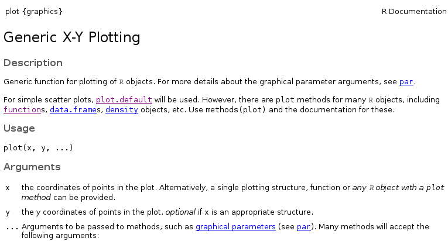
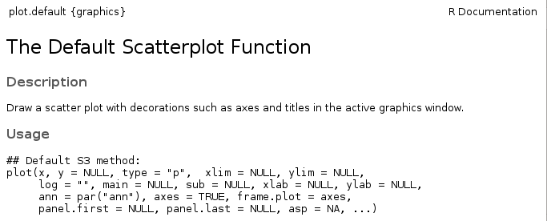

```{r setup, include=FALSE}
knitr::opts_chunk$set(prompt=FALSE, cache = TRUE) 
```

## Base R Graphics
- R includes highly flexible and powerful tools for visualizing many kinds of data
    - One tool for analysis and visualizing == win-win!
- However, using these tools can seem trying to hike through the Amazonian jungle, so its good to have a guide
- We will try to balance the two approaches to learning plotting in R
    - The "cookbook" approach: When you have data like *w*, plot them with function *x* and use arguments *y* and *z*
    - The "microscope" approach: Study the behavior of function *x* in depth, learning every in and out of how it works, every quirk, etc.
    
## plot {.img-centered}
- Lets start with the most commonly used graphing function: `plot()`
- Using the `pressure` data set, lets plot the [vapor pressure](https://en.wikipedia.org/wiki/Vapor_pressure) exerted by mercury as a function of its temperature.

```{r pressure,fig.height=3,echo=-1, warning=FALSE}
par(mar = c(4,4,1,1))
plot(pressure$temperature, pressure$pressure)
```

## plot {.img-centered}
```{r ref.label="pressure",echo=FALSE,fig.height=3,warning=FALSE}
```

- We can gather that as temperature goes up, vapor pressure goes up as well, but this isn't the world's prettiest graph. Lets go to the help page and see if we can tweak it to looks a little nicer
    - `?plot`

## plot {.helppage}
Wait, plot only takes 2 arguments???

But look, there's that `...`

<br>

## Global Graphical Parameters
Deep down, inside ~~the depths of the earth~~ the **graphics** namespace, R maintains default settings that govern the appearance of every figure you generate.

- Sometimes, you can change these settings through the function interface itself
    - e.g., through the `plot()` function & the `...`
    - This will change the settings for the current figure *only*
- You can change these setting on a global level (i.e. every subsequent plot) using the `par()` function
    - Mortals beware of the help page for `par()`
    - We'll use par soon enough =)

## Plot-Specific Parameters {.helppage}
For now, we're going to look at which aspects of our figure we can change *just* through the `plot()` function interface. 

The second paragraph of the description gives a clue as to where we can find out our options: "For simple scatter plots, `plot.default` will be used".

If we navigate to the `plot.default` help page, we see this:

<br>

## Plot-Specific Parameters {.img-centered}
- Start by changing the 3 things you always change:
    1. The x-axis label, set with the `xlab` argument
    2. The y-axis label, set with the `ylab` argument
    3. The plot title, set with the `main` argument
```{r changelabels,fig.height=2.5,echo=-1}
par(mar = c(4,4,1,1))
plot(pressure$temperature, pressure$pressure, xlab="Temperature (C)",
     ylab="Pressure", main="Vapor Pressure of Mercury")
```

## Plot-Specific Parameters {.img-centered}
- We can also change way the data points are displayed, with the `type` argument.
    - Points plus a line connecting them can be done by setting `type = "o"`
```{r overplotting,fig.height=2.5,echo=-1}
par(mar = c(4,4,1,1))
plot(pressure$temperature, pressure$pressure, xlab="Temperature (C)",
     ylab="Pressure", main="Vapor Pressure of Mercury",type="o")
```

## Interfacing with `par` via `plot`
- You can manipulate other aspects of your plot's appearance in the function call to `plot()`, even though they are not listed in the **Usage** section
    - This is because `plot()` passes named arguments that don't match its own list of arguments onto the common graphics settings function, via that `...`
    - This way, the settings will only affect the current plotting command

## Interfacing with `par` via `plot`

Argument | Behavior | Values
---- | -------- | ------
col | Point and line color | [color name string](http://www.stat.columbia.edu/~tzheng/files/Rcolor.pdf) or [RGB hex value](http://www.color-hex.com/)
pch | "Point Characters"; The symbols used for points | Numeric vector (see `?points`) [Cheat Sheet](http://vis.supstat.com/2013/04/plotting-symbols-and-color-palettes/)
bg | The fill color of points | Same as `col`
lty | line type (dotted, dashed, etc.) | Type name or numeric vector [Cheat Sheet](http://www.statisticstoproveanything.com/2010/10/chart-of-different-lty-values-in-r.html)
lwd | Line thickness (including point perimeters)| Numeric Vector
cex.* | Magnification (2x, 3x bigger, etc.) | Numeric Vector

## Change all the things!
```{r allthingsmustchange, fig.height=3.75, echo=-1, fig.align='center'}
par(mar = c(5,5,2.5,1))
plot(pressure$temperature, pressure$pressure, xlab = "Temperature (C)",
     ylab = "Pressure (mm of Hg)", main = "Vapor Pressure of Mercury",
     type="o", lwd = 3, lty = 2, pch = 24, col ="darkmagenta",
     bg = "cyan", cex = 2, cex.main=2, cex.lab = 1.5, xlim = c(-100,500),
     ylim = c(0,1000))
```


## Activity
Using the `mtcars` dataset, plot each cars miles per gallon against its weight in a scatter plot (miles per gallon is in the `mpg` column, and its weight is in  the `wt` column). 

Plots the points in fillable diamonds, and set the fill color (aka background color) of those points to something pretty (see `colors()` for a list). Also add a title and informative axis labels. 

What kind of relationship do weight and mpg have?

```{r mtcars, include=FALSE}
plot(x=mtcars$wt, y=mtcars$mpg, main="Automobile MPG vs. Automobile Weight",
     xlab = "Weight (lb/1000)", ylab = "Miles per. Gallon",
     pch=23,bg="chartreuse")
```

## Adding to an existing figure
- We rarely plot one set of points or one line and call it a day. Having two sets of data on a figure that makes comparison easy is often the entire point of a figure!
- R includes functions for modifying existing figures. We'll now look at functions that:
    - Add new points
    - Add new lines
    - Add text annotations 
    - Add legends

## Adding points
- Not surprisingly, the R function which can draw new points is called `points`
- Just like `plot()`, `points()` only has a few explicit arguments, but passes on arguments to the underlying graphics settings in R. 
    - `col`, `pch`, `lwd`, `bg`, and `cex` are all commonly used with `points()`
- But unlike plot, `points()` does not have a way to change things on the "outsides" of the plots
    - Can't change the axis title, axis limits, main title, etc.

## Adding points {.img-centered}
Lets plot the exponential and logarithmic functions of base 2 against each other, at a few small integers.
```{r logandexp,fig.height = 3.5, fig.width =4, echo=-1}
par(mar = c(4,4,1,1))
plot(x=0:4,y=2^(0:4),col="blue",xlim = c(0,8),ylim=c(0,16),
     main = "Log and Exponential, Base 2",ylab= "y",xlab="x")
points(x=0:8, y = log2(0:8),col = "red")
```

## Adding lines {.img-centered}
Next we'll visualize this relationship with a line graph via the `lines()` function. If we want a smooth line, we'll need to use *a lot* of points.
```{r logandexp_line,fig.height = 3, fig.width =3.5, echo=-1}
par(mar = c(5,4,1,1))
x1 <- seq(0.01,4,.01) # 400 points, .01 apart
x2 <- seq(0.01,8,.01) # 800 points, .01 apart
plot(x=x1,y=2^(x1), col="blue", xlim = c(0,8),ylim=c(0,16),ylab= "y",
     xlab="x", main = "Log and Exponential, Base 2", type='l',lwd=2)
lines(x=x2, y = log2(x2), col = "red",lwd=2)
```

## Adding text {.img-centered}
Next we'll add the identity line, and label it with the `text()` function.
```{r logandexp_identity,fig.height = 4, fig.width =4, echo=c(6,7)}
par(mar = c(4,4,1,1))
x1 <- seq(0.01,4,.01) # 400 points, .01 apart
x2 <- seq(0.01,8,.01) # 800 points, .01 apart
plot(x=x1,y=2^(x1), col="blue", xlim = c(0,8), ylim=c(0,16),
     main = "Log and Exponential, Base 2", ylab= "y", xlab="x", type='l',lwd=2)
lines(x=x2, y = log2(x2), col = "red", lwd=2)
lines(x=seq(0,8,.01),y=seq(0,8,.01), lty=2)
text(x=4,y=4.75,labels="y=x") # centered at (4,4.75)
```

## Adding a legend {.img-centered}
We'll include a legend that associates each function with its line color so others can tell which function is which, using the  `legend()` function.

In `legend()`, we need to tell the function to where to draw lines, what to label them, what to color them, and to  skip the bounding box on the legend.
```{r logandexp_legend,fig.height = 3.25, fig.width =4, echo=8}
par(mar = c(4,4,1,1))
x1 <- seq(0.01,4,.01) # 400 points, .01 apart
x2 <- seq(0.01,8,.01) # 800 points, .01 apart
plot(x=x1,y=2^(x1), col="blue", xlim = c(0,8), ylim=c(0,16),
     main = "Log and Exponential, Base 2", ylab= "y", xlab="x", type='l',lwd=2)
lines(x=x2, y = log2(x2), col = "red", lwd=2)
lines(x=seq(0,8,.01),y=seq(0,8,.01), lty=2)
text(x=4,y=4.5,labels="y=x") # centered at (4,4.5)
legend("topright", legend = c("Exponential","Logarithmic"),
       col=c("blue","red"),lty=1, bty="n")
```

## Activity
Show the standard normal PDF and the Student's t PDF with 15 degrees of freedom on the same plot, across a reasonable range on the x-axis.

Plot the distributions in 2 different colors, and add a legend telling the viewer which color corresponds to which distribution. 

Remember that you can calculate the normal density at any point on the x axis using `dnorm` and the t density using `dt`.

```{r activity_solution,include=FALSE}
x <- seq(-4,4,.01)
y1 <- dnorm(x)
y2 <- dt(x,15)
plot(x,y1,type="l",col="blue",lwd=2, main = "Normal vs t",
     ylab = "Density")
lines(x,y2,col="red",lwd=2)
legend(x="topright",legend=c("Standard Normal","Students T"),
       col = c("blue","red"),lty=1,lwd=2)
```
## Next Time

Next Up: bar plot, box plots, histograms, and `par()`
