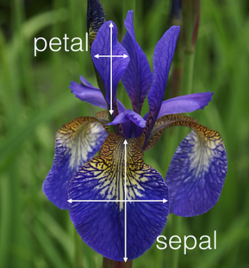

```{r setup, echo=FALSE, include=FALSE}
library(whoppeR)
library(pander)
knitr::opts_chunk$set("warning"=FALSE, "message"=FALSE, "fig.width" = 6, "fig.height" = 3.5, "fig.align" = 'center', "cache" = TRUE)
ggplot2::theme_set(ggplot2::theme_grey(base_size = 16))
```

## The Grammar of Graphics
We're going to continue the tour of the `ggplot2` package we began [last week](./ggplot_part1.html)

We'll explore some more "advanced" features of the package, look at data management issues in the context of ggplot-ing, and make some common types of visualizations.

NB: This lab was made using ggplot2 version `r packageVersion("ggplot2")`, and a few things I'll be using are specific to ggplot2 version >= 2.0. So, if you have an older version installed, you'll need to upgrade to follow along. You can check your version using the command `packageVersion("ggplot2")`

## The `iris` dataset {.img-centered}
We'll begin our examples with the `iris` dataset, which gives measurements of the length and width (in cm.) of the sepals and petals from 3 species of irises (*setosa*, *versicolor*, and *virginica*).


## The `iris` dataset
Lets take a glimpse at the data itself.
```{r iris, echo=FALSE}
pander(prettifyTable(iris,6), split.tables = Inf)
```

## The `iris` dataset
Let's warm up by making a scatter plot of Sepal width against the Sepal length for the 3
different species. We'll save the plot as an object, so we can build on it in later slides.

```{r iris_scatter, fig.height=2.75}
library(ggplot2)
p <- ggplot(data = iris, 
        mapping = aes(x = Sepal.Length, y = Sepal.Width, color = Species)) +
  geom_point()
print(p)
```

## Adding smooths
ggplot has a special geometric object called a "smooth", which is a line path whose x and y values are determined by a regression algorithm (e.g., `loess`, or `lm`).

We can show a regression line and conditional mean C.I. for each flower group by adding a `geom_smooth` layer to the plot, and setting the `method` argument to be `"lm"`.

```{r iris_smooth, fig.height=2.75}
p + geom_smooth(method = "lm", fullrange = TRUE)
```

## Layer-specific data and mappings
So far, any geometric object layers we've added have inherited their data and aesthetic mapping from the "global" mapping defined in the call to the `gpplot` function.

However, that need not be the case: geoms can set their own layer-specific data sets and aesthetic mappings. The layer-specific dataset or mapping  is set inside the call the `geom_*whatever*`, using the same syntax as inside `ggplot`.

This feature is most useful for visualizing data from two different observational units (e.g., data from individual subjects, and summary statistics for each experimental condition).

To see how to do this, let's show the *average* Sepal width and length for each Iris species on our plot of the raw observations.

## Layer-specific data
To do this, we'll need to a data frame that summarizes the Sepal length and width for each species with their average size.

We'll start creating this data frame by grouping the iris dataset by the `Species` variable and averaging all the remaining columns.

```{r sepal_summary}
library(dplyr)
iris_means <- iris %>% group_by(Species) %>% summarise_all("mean")
pander(iris_means, split.table = Inf)
```

## Layer-specific data
Now, we'll include another layer of points, and use the summarized dataset as its source of information. We'll also use a different shape (an X), size, and thickness, so we can distinguish the means from the raw data.

```{r means}
p + geom_point(data = iris_means, size = 4, shape = 4, stroke = 2)
```

## Adding Petal Width and Length
So far we've only been looking at half the data, so lets add in the Petal length and width measurements. 

But there is a problem: the widths and lengths for Petals and Sepals are separate variables!

```{r, echo=FALSE}
pander(prettifyTable(iris,2), split.tables = Inf)
```

This means we can't easily add a new aesthetic mapping to distinguish Sepal measurements from Petal measurements, because there is no single variable in the data set which identifies Sepal measurements from Petal measurements.

## The `iris` dataset
We'll need to reshape the data, so that one variable in the data set identifies Sepal measurements from Petal measurements in the `Length` and `Width` variables.

```{r iris_reshape}
library(tidyr)

# Add a primary key
iris_long <- mutate(iris, FlowerID = 1:nrow(iris)) %>%
  # change layout to long-form
  gather(key = variable, value = size, Sepal.Length:Petal.Width) %>%
  # Break "Sepal/Petal" & "Length/Width" into 2 columns
  separate(variable, c("Structure", "dimension"))

# Make a separate variable for length and width measurement
iris_normal <- spread(iris_long, dimension, size)
```

## The new `iris_normal` dataset
Ah, much better
```{r iris_normal, echo=FALSE}
pander(prettifyTable(iris_normal, 7), split.table = Inf)
```

## Plotting Petal and Sepal measurements
Since the plot of just the Sepal measurements was already pretty "full", I think the best way to add in the Petal measurements is to put the Sepal measurements and the Petal measurements into two different panels.

Panel's are called `facets` in the "grammar of graphics", and are functionally similar to dividing the plot window up into a "matrix" of different plots in base R plotting with `par(mfrow = c(x,y))`.

Facets are added to the plot with the `facet_grid()` function (for when the number of facets could evenly fill a matrix) or the `facet_wrap()` function (for the more general case when the number of facets does *not* evenly fill a matrix)

## Facetting
Facets are added just like adding a new geom layer, and the layout of the panels is determined using formula syntax. 

Here, we're asking for that dataset to be divided into different panels according to the values of the `Structure` variable.

Variables on the *left* side of the `~` map onto vertically arranged panels, and variable names on the *right* side map onto horizontally arranged panels.

```{r facetting, eval = FALSE}
p <- ggplot(data = iris_normal, 
        mapping = aes(x = Length, y = Width, color = Species)) +
  geom_point()
p + facet_grid( ~ Structure)
```

We'll show the plot on the next slide...

## Facetting
```{r, ref.label="facetting"}
```
Panels created with faceting share the same scales!

## Facet Labels
If you want to change the panel labels, you'll need to use whats called a labeller function. The easiest way to create a labeller function is by the calling the function *called* `labeller` on a named character vector.

The *names* of the elements in the character vector should be values of the variable you are faceting by, and the elements themselves should be the labels you want to appear in the plot.

For the `Structure` variable, this would look something like:
```{r make_a_labeller, eval=FALSE}
labeller(Structure = c("Petal" = "Pointy Petals",
                       "Sepal" = "Sexy Sepals")
         )
```

## Facet Labels
Then take this function and supply it as the `labeller` argument of `facet_grid` or `facet_wrap`.
```{r change_facet_labels}

p + facet_grid(~ Structure,
               labeller = labeller(Structure = c("Petal" = "Pointy Petals",
                                                 "Sepal" = "Sexy Sepals")))
```


## Plots with error bars
Lets switch from scatter-plotting the lengths and widths to plotting some summary statistics of the Petal/Sepal lengths and widths for each species.

Of course, any good plot of summary statistics includes error bars. Luckily, ggplot makes it easy to add error bars, with the `geom_errorbar` function.

Step 1: Summarizing the long-form dataset, including the upper and lower bounds of the 95% CI.

```{r summarising}
iris_means <- iris_long %>%
  group_by(Species, Structure, dimension) %>%
  summarise(avg = mean(size), SD = sd(size), N = n()) %>%
  mutate(SEM = SD/sqrt(N),
         upper = avg + SEM*qt(.975, N-1,lower.tail = F),
         lower = avg - (upper-avg))
```

## Petal/Sepal Averages
```{r averages, echo = FALSE}
pander(iris_means, split.table = Inf)
```

## Plotting the averages
This time, let's put the type of structure measured on the x-axis (i.e., map the `dimension` variable to the `x` aesthetic).


```{r plot_averages}
p <- ggplot(iris_means, aes(x = dimension, y = avg, color = Species)) +
  geom_point() + facet_grid(~Structure)
print(p)
```

## Adding the confidence intervals
To add error bars for the confidence intervals, all we need to do is add a new layer containing them with `geom_errorbar`.

The 2 important aesthetics for the error bar geoms are `ymin` and `ymax`, which should be mapped to the `lower` and `upper` variables, respectively.

```{r error_bars, fig.height = 3.25}
p + geom_errorbar(aes(ymin = lower, ymax = upper), width = .15)
```

## A barplot of the averages
You could also plot these averages with a barplot, which can be created with `geom_col`. Making a bar plot requires a little tweaking:

  - The `color` aesthetic of bars corresponds to the color of the bar's perimeter, rather than the color of its area, so we need to map the `Species` variable to the `fill` aesthetic instead
  - To get side-by-side bars (instead of stacked bars), we need tell `ggplot` to spread each bar out across the x axis the `position_dodge()` function. This function takes 1 argument (`width`), which controls how far apart the bars are placed


## A barplot of the averages
Here's how we apply those tweaks to get a bar plot of the averages
```{r}
p <- ggplot(iris_means, aes(x = dimension, y = avg, fill = Species)) + 
  geom_col(position = position_dodge(width = 1)) + 
  facet_grid(~Structure)
print(p)
```

## A barplot with errror bars
To include error bars, we use `geom_errorbar` like before, but we also must set `position_dodge(width = 1)` to get each error bar to match up correctly.
```{r}
p + geom_errorbar(aes(ymin = lower, ymax = upper),
                  position = position_dodge(width = 1),
                  width = .15)
```

## Miscellaneous
There is still a lot more to ggplot (the author of the package has a [great book](https://www.amazon.com/ggplot2-Elegant-Graphics-Data-Analysis/dp/331924275X)) but here are a few more pointers.

- You'll often need to change the name and limits of a scale. You can do this by invoking the appropriate `scale_*whatever*` function, and using the `scale_name` and `limits` arguments
    - E.g., `scale_y_continuous(scale_name = "Petal Width", limits = c(0,15))`
- Things like font, font size, background color, aspect ratio, etc., are controlled using the `theme` function.
    - The `theme` function is quite extensive, so see [this list](http://docs.ggplot2.org/current/theme.html) and `?theme` for a description of all its arguments and options.
    - `ggplot2` includes several pre-made themes (e.g., use  `p + theme_bw()` for black and white, or `p + theme_dark()`)

## Activity
The `esoph` dataset reports the number of patients who did and did not develop esophageal cancer given three observational variables: age, alcohol consumption, and tobacco consumption (see `?esoph` for more info).

First, create 3 new variables using the code below.

  - `p`: The probability of getting cancer
  - `upper`: The upper bound of cancers (assuming a binomial distribution) 
  - `lower`: The lower bound of cancers (assuming a binomial distribution)

```{r}
esoph <- mutate(esoph,
                cell_size = ncontrols + ncases,
                p = ncases/cell_size,
                upper = qbinom(.975, size = cell_size, prob = p) / cell_size,
                lower = qbinom(.025, size = cell_size, prob = p) / cell_size,
                cell_size = NULL)
```

## Activity
Plot the probability of cancer for each group, along with errors bars, using

  1. A barplot
  2. A dot-plot

Remember to take advantage of facets, including `facet_grid` or `facet_wrap`.

```{r, include=FALSE}
ggplot(esoph, aes(x = agegp, y = p)) +
  geom_col(position = position_dodge(width = 1.5)) + 
  facet_grid(alcgp ~ tobgp) + 
  geom_errorbar(aes(ymin = lower, ymax = upper),
                position = position_dodge(width = 1.5), width =.15)
```


```{r, include=FALSE}
points <- data.frame(age = 1:1600)
preds <- as.data.frame(Orange) %>% 
  group_by(Tree) %>% 
  do(model = lm(circumference ~ age, data = .)) %>%
  mutate(model = list(predict(model, points)),
         age = list(points$age)) %>%
  tidyr::unnest() %>%
  rename(circumference = model)

ggplot(data = Orange,  mapping = aes(x = age, y = circumference, color = Tree)) + 
  geom_point() + 
  geom_line(data = preds) + 
  scale_color_brewer(palette = "Set1", limits = as.character(1:5))
```
