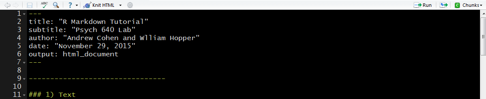
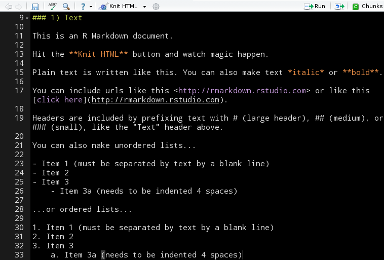
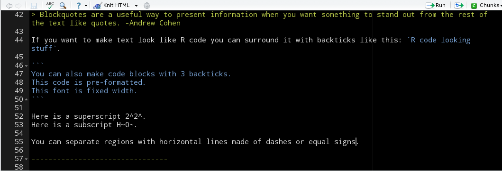
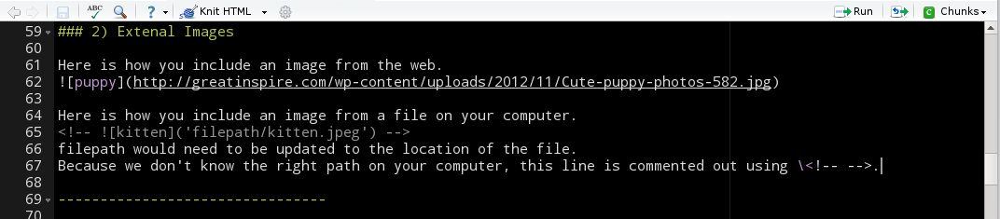
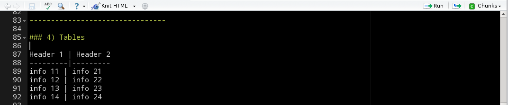

<style>
.in-list-img img {
  padding: 0;
}
</style>

```{r setup, include=FALSE}
knitr::opts_chunk$set(prompt=TRUE, cache = TRUE) 
```

## What is the Rmarkdown toolkit?

More generally, it provides a solution to the problem of separating our work from our reporting of that work.

More specifically, it is a toolkit which allow us to tightly integrate any code used to solve a problem, the results of running that code, and the human-readable explanation of the methods and the solution.

By using the Rmarkdown toolkit, we can blend human language, computer language, and computer output in a single, executable file.  

The final product of our work becomes a typeset PDF or HTML document explaining all of our work and results, rather than an arcane R script and console output with random copy-pasta to a word document.

## Installing Dependencies

If you're running a newer version* of Rstudio, then you should have Rmarkdown installed already. Other R package dependencies will be automatically pulled in as needed when you start using Rmarkdown.

In non-Rstudio environments, you must manually install the Rmarkdown package with <kbd> `install.packages("rmarkdown")` </kbd>. You'll also need to install [pandoc](http://pandoc.org/installing.html), which is a standalone executable that converts document between formats.


<br><br><br><br><br><br>

*newer means newer than version 98.932 (released June 2014)

## Documentation
Since we can't exhaustively learn Rmarkdown in one class, you'll need to know where to look for help and refreshers.

- Be sure to look at all the pages at http://rmarkdown.rstudio.com/
- Under the "Help" menu in Rstudio, you can open a built-in markdown quick reference. This opens in the same pane as the help files for R functions.
- Thoroughly explore all the chunk options at http://yihui.name/knitr/options/ (more on chunk options later in the class).
- For a longer, more in depth intro checkout [this tutorial](http://www.introductoryr.co.uk/Reproducibility/Markdown_guide.html) by Rob Knell

## The R part of Rmarkdown {.sampleslide}
1. Start by going to File --> New File --> R Markdown
2. In the a dialogue box, select HTML as our output format. 
3. Choose your title and set yourself as author.
4. Hit the "Knit HTML" button just above the editor window and you shoud something like:


## Success! Now, more work!
We've created our first dynamic document, huzzah!

But we're going to learn even more than how to press some buttons, so grab <a href="https://raw.githubusercontent.com/wjhopper/psych640/master/data/rmarkdown_example.Rmd" download>this .Rmd file </a>, open it up and let's get to making even better documents.

We'll work through the sections of this document together, and as we go through it, try to connect the dots between the format of the input document, and the resulting elements in the output document.

## YAML
The section at the very top, separated by `---`, is called the YAML header (YAML stands for **Y**AML **A**int **M**arkup **L**anguage). 

The YAML header stores info about your document *in* your document (i.e. **metadata**), and tells the interpreter about how to render the final document.


For example, the <kbd> `output: html_document` </kbd> option tells interpreter to construct an HTML document (as opposed to a PDF)

## Markdown & Plain Text Basics

\


## Markdown & Plain Text Basics

\


## Images

\


## Embedding Equations with LaTeX syntax
- For inline equations, enclose your equations in single `$` like so: <kbd> `$equation$` </kbd>
- To give your equation its own centered "paragraph", use double `$` with spaces, like so: <kbd>`$$ equation $$`</kbd>


## Tables

\

<br>

Header 1 | Header 2 
---------|---------
info 11 | info 21
info 12 | info 22
info 13 | info 23
info 14 | info 24

## R code chunks

\


## Converting R data structures to Markdown

\


```{r kablingReal,results="asis",echo=FALSE}
library(knitr)
kable(summary(cars),row.names = FALSE, caption = "With Knitr")
```

## Chunks with Plots


```{r Car plot, echo=FALSE, fig.height=4, fig.width=4.5, fig.align='center'}
par(pty='s', mar=c(6,2,2,4))
plot(cars)
```

## Other Features {.in-list-img}

RStudio also allows you to evaluate the code inside you code chunks without knitting the document.

- You can run code line-by-line with the `Run` button
- You can run the entire code chunk by pressing the small green "play" button on the right side of the chunk 
    - Looks like 
- You can run all *preceeding* chunks by pressing the small grey arrow next to the green play buttton
    - Looks like 


## Activity: Writing a Report on `InsectSprays`
1. Create a new .Rmd file, set up to compile to HTML
2. Use an inline R expression to make the date stamp update each time the document is compiled. Do this by embdedding the function `Sys.Date()` in the date YAML field. Be sure to keep the enclosing double quotes!
3. Make a center-aligned boxplot of the distribution of `count` values for each value of `spray` in the `InsectSprays` data frame.
    - Hint: Remember you can use the `~` operator in the call to `boxplot()`
4. Below the figure, write a one sentence description of the plot (e.g. a short figure caption).
5. Add a proper table summarizing the `InsectSprays` data frame in your document using `kable`. Keep the line of R code loading the `knitr` package out of the final document.

## Styling your HTML
Your resulting HTML document can be extensively customized by including styling information via CSS (**C**ascading **S**tyle **S**heets).

Teaching you HTML + CSS is *definitely* outside the scope of this class, but there are approximately 10<sup>20</sup> tutorials and classes available online that you can use.

When you have written a style sheet you want applied to your HTML document, you can include it via the `css` YAML header like so: 

`css: "path/to/your/stylesheet.css"`

## Producing HTML slideshows with Rmarkdown
You can take an existing Rmd file, change the output type in the YAML header to `ioslides_presentaion`, and then add slide separators everywhere you want to divide content up into discrete slides. 


Or if you want to start a new Rmd file set up to compile to a slide show, go to File --> New File --> R Markdown, select "Presentation" from the menu on the left, and pick your format (I prefer ioslides)

## Producing PDFs with Rmarkdown
It also easy to make your final document a PDF. Creating PDFs requires a $\LaTeX$ installation. [MikTeX](http://miktex.org/download) is preferred for Window's, while [MacTex](https://tug.org/mactex/mactex-download.html) is prefered for Mac.

Once $\LaTeX$ is installed, just change the `output` YAML header value to `pdf_document` to set PDF as final format.

Because they are typeset with $\LaTeX$, you have more powerful formatting options when compiling to PDF. But, having a paginated final product can mean more typsetting headaches, especially with table and figure placement, relative to HTML.
