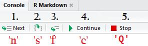
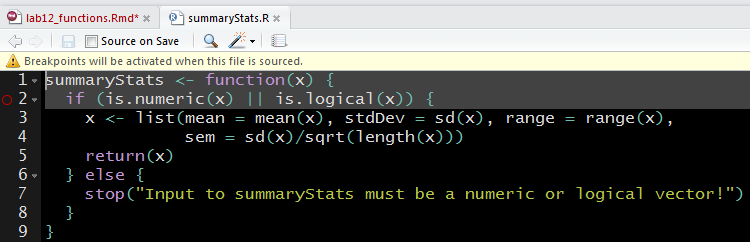

```{r setup, include=FALSE}
knitr::opts_chunk$set(prompt=TRUE, cache = TRUE) 
```

## Why write a new function?
Consider a common situation: You as a programmer need to perform a set of identical or extremely similar operations on several different pieces of information.  What do you do? 

The solution with the least upfront cost is to write the code necessary for your task once and copy and paste it into the places where you'll need it, tweaking little things each time for the specific information you're operating on.

While straightforward, this approach ends up costing more in the long run: Your script quickly grows in length and becomes difficult to read, and any time you need to make a change, you have to carefully keep track of every instance that needs changing.

## Why write a new function?
A better approach which keeps your code clear and maintainable is to keep it [DRY](https://en.wikipedia.org/wiki/Don't_repeat_yourself), meaning "Don't Repeat Yourself". 

Following the DRY principle when writing your code means that every piece of knowledge (e.g., how to calculate the mean in code, how to calculate the standard error in code) must have a **single, authoritative representation**.

When you have a set of operations you want to use more than once, writing a function to contain them allows you to reuse the code *without* repeating the code itself.

## Creating New Functions
You can create a new function object in R with the `function` keyword and the following syntax:
```{r funcDefinition, eval=FALSE}
f <- function(arguments) { body }
```
This expression is called a *function declaration* or a *function definition*.

`arguments` represents a set of variable names (and optionally default values) to be used within the function, and `body` represents one or more an R expressions.

The usual assignment operator, `<-`, creates the object you can use to call the function. Just like any other variable, the name to the left of the `<-` operator is arbitrary.

## Arguments
Any arguments defined in the declaration can be used as variables inside the function body. To define multiple arguments, each argument must be separated by a comma.

The function definition below creates a new function object `f`, which takes two arguments, `arg1` and `arg2`, and prints out a report of their values to the console.
```{r required, eval=TRUE}
f <- function(arg1, arg2) { 
  print(paste("arg1 is", arg1, "and arg2 is", arg2))
}
f("eleventeen", -Inf)
```

## Optional Arguments
You can assign default values for arguments with the `=` operator. While the `<-` and `=` operators are usually interchangeable, **only `=` may be used in function definitions and function calls**.

If you assign a default value, the argument is optional and may be omitted in the function call.
```{r optional, eval=TRUE}
f <- function(arg1, arg2="not supplied!") { 
  print(paste("arg1 is", arg1, "and arg2 is", arg2))
}
f("squidily diddly") # only 1 argument given!
```

## Required Arguments
Omitting arguments *without* a default value must always be specified on the function call. Omitting them will always result in a fatal error.
<div class = "errormsg">
```{r optionalTwo, error=TRUE}
f(arg2=pi) # I always forget pi is a built in constant!!
# Sorry for the formatting, errors don't line wrap
```
</div>

## A reminder: positional vs. named arguments
when you call a function without using argument name, the values you supply are matched with the functions arguments **by position** (i.e., first supplied value goes with argument 1, second supplied value goes with argument 2, etc.)
```{r unnamed}
f("sir nose d'voidoffunk", "starchild")
```
But, when you pair the values with argument names, they may be specified in any order.
```{r named}
f(arg2 = "sir nose d'voidoffunk", arg1 = "starchild")
```

## The function body {.img-centered}
The function body should just contain normal R code! Easy!

Here's a picture of [Sir Nose  D’Voidoffunk](https://www.youtube.com/watch?v=YNXkw96HC7k) to take up the slide.


His nose is long because he's been fakin' the funk.

## Function output
All the functions you're familiar with do more than just print something to the console: they give you a result in the form of an R object, which you can assign to a variable in your environment.

Lets try assigning the output from our function to a variable:
```{r assign}
report <- f(-1.05)
report
```
It appears our function output is the character vector we created in the function body.

## Function output
This makes intuitive sense on one level: making that string was the only expression in the function body, so what else would the output be?

But consider more complex functions with many lines of code: which value should be the one the function outputs?

By default, functions return the value of the **last** expression evaluated in the function body.

## Return Statements
However, relying on implicit behavior doesn't make for the most understandable code. Additionally, you may want to a function to stop running and return a value at different places of the body (an 'early return').

For these reasons, R has a reserved keyword `return` which halts a functions execution and returns the value specified to `return`.
```{r returns, eval=TRUE}
f <- function(arg1, arg2="not supplied!") { 
  x <- paste("arg1 is", arg1, "and arg2 is", arg2)
  return(x)  # Same behavior, but more explicit
}
f("autumn leaves")
```

## Returning multiple values
If you were writing a function to perform a t-test, you would probably  like to write one function that tells you the t score, the degrees of freedom, and the *p* value, instead of writing one function for each.

Unfortunately, returning multiple objects is impossible in R; the language simply does not support this behavior.

However, we can circumvent this limitation by storing the multiple values we want to be output together in a single object!

## Returning multiple values
Returning a list is a good general purpose solution to this problem, because lists are designed to have elements of arbitrary length and type.

For example, this function returns a list of summary statistics for a numeric vector, which can then be accessed by name from the list.
```{r listReturns, eval=TRUE}
summaryStats <- function(x) {
  x <- list(mean = mean(x), stdDev = sd(x), range = range(x),
            sem = sd(x)/sqrt(length(x)))
  return(x)
}
statList <- summaryStats(runif(25,0,100)) #25 random values from 0 to 100
statList$sem
```

## Using your functions
Like any object in R, your function object must be assigned and available from the global environment before you can use it.

This raises the question of how to make your functions available whenever you need them, like the functions from base R or an R package.

One option is to have a section starting each script where you define the personal functions you wish to use.

However, this method makes scripts confusing to follow, and is prone to error thanks to violating the DRY principle: when you make a change to your cool new function in one script, you have to change it in every file you've declared it in if you want to the function to have consistent behavior (which every function should!!!)

## Sourcing your functions
A better solution is to have one .R file where you define a single function (or several of related functions), and use the `source` keyword to execute the file and define the function whenever you want use it.

```{r sourcing, eval = FALSE}
source('/path/to/file/with/function/definitions.R')
```

`source` executes any R expressions found in the specified file in the environment where `source` was called. For example, executing the expression `x <- 10` in the console and writing `x <- 10` in a separate file and sourcing that file have the same effect. 

You can treat the `source` keyword like the `library` function this way, and adhere to the DRY principle by having single, authoritative versions of your functions.

## User-Defined Errors
The `summaryStats` function implicitly requires that it's argument, `x`, be a numeric vector. If `x` is not a numeric vector with one or more elements, it makes no sense to take the mean or standard deviation.

Of course, *you* know that, because you wrote the function, and *you* would never dream of passing a character vector or list to `summaryStats`.

But can you guarantee that you group member or lab member knows that? And can you absolutely guarantee that `summaryStats` won't be unintentionally passed some other type of data when called from a more complex or non-interactive program?

## User-Defined Errors
The answer of course, is no. When you write a function, you should think carefully about what range of inputs your function can reliably compute sensible output from.

Then, write expressions which test to be sure input meets your accepted conditions, and throw your own *informative* errors when they are not.

## User-Defined Errors
R provides the `stop` function which allows you to signal an error using your own message, and halt execution of the current function. 

We can use it together with an `if` statements to enforce our requirement that the input to `summaryStats` be numerals of some kind.

```{r stopclause, echo = 1, results=FALSE}
summaryStats <- function(x) {
  if (is.numeric(x) || is.logical(x)) {
    x <- list(mean = mean(x), stdDev = sd(x), range = range(x),
              sem = sd(x)/sqrt(length(x)))
    return(x)
  } else {
    stop("Input to summaryStats must be a numeric or logical vector!")
  }
}
```

## User-Defined Errors
Lets test it out!

First, a numeric vector which should be fine.
```{r  passes}
statList <- summaryStats(runif(25,0,100))
statList$mean # good!
```

Now, a character vector which should fail.
<div class="errormsg">
```{r  fails, error=TRUE}
statList <- summaryStats(as.character(runif(25,0,100)))
```
</div>

Hooray, an error! Whenever you write a test for your input, always test it with bad input to be sure it catches it.

## Debugging your functions
The process of examining your code to track down the source of errors is easy enough in a normal R script: just interactively run one line at a time till you find the root cause.

But debugging a function provides a new challenge: How do you get inside the function *while its running* to closely examine it's behavior with real input?

We'll cover two basic ways you can debug code execution inside functions: by using the `debug` function, and by setting breakpoints through Rstudio. 

## The `debug` function
When you want to interactively debug a function, provide the function object as an argument to the `debug` function.

```{r debug, eval =FALSE}
debug(summaryStats)
```
This appears to have no effect, but it tells R that whenever `summaryStats` is called, to pause before the first line of the function body is executed, and open an interactive console inside the function's environment. 

So, the next time `summaryStats` is called, debugging mode will activate! 

The console prompt `>` should change to read `Browse [x]>`, where x is some integer. In Rstudio, a new tab should open in the editor pane titled "Source Viewer", and a set of navigation controls should appear just above the console window.

## Interactive Debugging { .img-centered }

The navigation controls & corresponding keyboard shortcuts are shown above, and explained below:

1. Executes the very next line of code in the function 
2. Executes the next function call and changes the current environment to that function
    - Allows you to follow the entire code path, not just code in your function
3. Executes all code remaining in the function, or all remaining iterations of a loop
4. Continue execution of all code normally (exits debugging mode)
5. Exit debugging mode and halt all execution

## Interactive Debugging
When you decide that you want `summaryStats` to execute normally and no longer run under debugging mode, use the `undebug` function:
```{r undebug, eval =FALSE}
undebug(summaryStats)
```
Any subsequent calls to `summaryStats` will proceed as normal.

## Setting breakpoints
A breakpoint is a flag set on a line of code in your function that tells the R interpreter to enter debugging mode when it hits that line. Just before executing the line with the breakpoint, R will enter debugging mode just like when you used the `debug` function.

This method can save you quite a bit of time versus using the `debug` function by allowing you to stop execution just before the line where an error occurs.

## Setting breakpoints { .img-centered}
To set a breakpoint, use the mouse to click in the blank space between the line number of the expression you wish to pause execution prior to and the left edge of the editor pane.

This should place an open red circle in the blank space where you clicked, and a small notification should pop up telling you that you must source the file to activate the breakpoints.


You can set as many breakpoints as you wish, but you need to source the file each time you add new ones to activate them.

## Setting breakpoints
Hit the 'source' button in the top right button of the editor pane to activate the breakpoints.  This should dismiss the popup, and the open red circle should become a filled red circle, indicating the breakpoint is active.

The console should echo the execution of a special function, `debugSource`, which is different from the `source` keyword mention earlier. The regular `source` function does **not** support sourcing files with breakpoints.

The next time this function is called, the function will pause before executing the lines with the breakpoints on them.

## Clearing Breakpoints
After you've squashed all your bugs, you can clear any breakpoints you've set by clicking on the red circles representing each one. This will remove the breakpoint, after which you must source the file again to deactivate them. 

## Activity
Write a function called `find` that searches a given vector for a specific value, and returns it's position(s) in the vector. 

By default, it should return a vector with an element for each position in the vector where the value is found. But there should be an argument which can be used to restrict the output to a limited number of positions (e.g, the position of the first occurrence, or the second and third, etc.).

Some hints:

- the `which` function can be used to find the position of `TRUE` elements in a logical vector
- Think carefully about the types of values which should be accepted for the argument controlling which positions are returned.

Go the next slide for some input/output examples to  help you start.

## Activity Examples
Here is a more a concrete example of what your function should behave like. When you think you are done, test your function to make sure your function can reproduce the results.

```{r activity, include=FALSE}

find <- function(vec, value, positions = NULL) {
  if (!is.null(positions) && !is.finite(positions) ) {
    stop("'positions' must be a numeric vector")
  }
  where <- which(vec == value)
  if (!is.null(positions)) {
    where <- where[positions]
  }
  return(where)
}
```

```{r activityTest}
v <- c(2,4,10,33,2,8,19,3, 20, 3, 4, 45) # vector to search
x <- find(v, 2) # search for 2, reporting all positions where it is found
all(v[x] == 2) # Indexing the vector with the results should produce all 2's
find(v, 2, 2) # Should produce 5 since the 5th element is the second 2
```